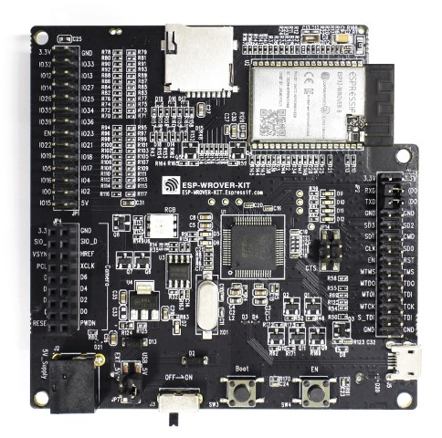
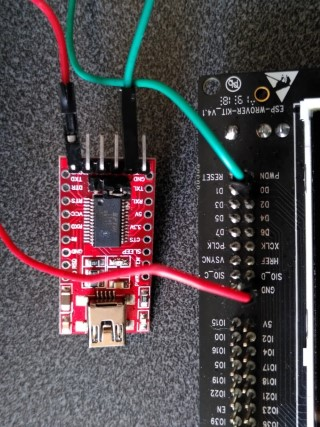

..
    Copyright 2019-2020 MicroEJ Corp. All rights reserved.
	This library is provided in source code for use, modification and test, subject to license terms.
	Any modification of the source code will break MicroEJ Corp. warranties on the whole library.

.. |BOARD_NAME| replace:: ESP32-WROVER-KIT v4.1
.. |BOARD_REVISION| replace:: v4.1
.. |PLATFORM_NAME| replace:: ESP32 WROVER Platform
.. |PLATFORM_VER| replace:: v1.6.0

.. |RCP| replace:: MicroEJ SDK
.. |PLATFORM| replace:: MicroEJ Platform
.. |PLATFORMS| replace:: MicroEJ Platforms
.. |SIM| replace:: MicroEJ Simulator
.. |ARCH| replace:: MicroEJ Architecture
.. |CIDE| replace:: MicroEJ SDK
.. |RTOS| replace:: FreeRTOS RTOS
.. |DEPLOYTOOL_NAME| replace:: Espressif Esptool
.. |MANUFACTURER| replace:: Espressif

.. _README MicroEJ BSP: ./ESP32-WROVER-Xtensa-FreeRTOS-bsp/Projects/microej/README.rst
.. _RELEASE NOTES: ./RELEASE_NOTES.rst
.. _CHANGELOG: ./CHANGELOG.rst

=============================
MicroEJ ESP32-WROVER Platform
=============================

This project is used to build a |PLATFORM| for |BOARD_NAME|
development board.

Clone the repository with ``git clone --recursive https://github.com/MicroEJ/ESP32-WROVER-KIT``.

Related Files
=============

This directory also contains

* `CHANGELOG`_ to track the changes in the MicroEJ
  ESP32-WROVER-KIT Platform
* `RELEASE NOTES`_ to list:

  - the supported hardware,
  - the known issues and the limitations,
  - the development environment,
  - the list of the dependencies and their versions.

* `README MicroEJ BSP`_ Recommended for users familiar with
  |MANUFACTURER| IDF and advanced usage on how to customize the build
  process.

Requirements
=============

- PC with Windows 10 or Linux (tested with Ubuntu LTS 20.04)
- Internet connection to `MicroEJ Central Repository <https://repository.miroej.com>`_
- |RCP| Dist. ``20.10`` or higher, available `here <https://developer.microej.com/get-started/>`_
- A |BOARD_NAME| board

Board Technical Specifications
==============================

- Name: |BOARD_NAME|
- Revision: |BOARD_REVISION|
- MCU part number: ESP32-WROVER-B
- MCU revision: -
- MCU architecture: Xtensa LX6
- MCU max clock frequency: 240 MHz
- Internal flash size: 540 KB
- Internal RAM size: 520 KB
- External flash size: 4 MB
- External RAM size: 8 MB 
- Power supply: USB, External 5V

Here is a list of |BOARD_NAME| usefull documentation links:

- Board documentation available `here <https://docs.espressif.com/projects/esp-idf/en/v3.3.4/hw-reference/modules-and-boards.html#esp-wrover-kit-v4-1>`__
- |MANUFACTURER| board Getting Started available `here <https://docs.espressif.com/projects/esp-idf/en/v3.3.4/get-started/get-started-wrover-kit.html>`__
- Board schematics available `here <https://dl.espressif.com/dl/schematics/ESP-WROVER-KIT_V4_1.pdf>`__
- MCU Technical Reference Manual available `here <https://www.espressif.com/sites/default/files/documentation/esp32_technical_reference_manual_en.pdf>`__
- MCU Datasheet available `here <https://espressif.com/sites/default/files/documentation/esp32_datasheet_en.pdf>`__
- MCU Errata available `here <https://espressif.com/sites/default/files/documentation/eco_and_workarounds_for_bugs_in_esp32_en.pdf>`__

Board Support Package Specifications
------------------------------------

- BSP provider: |MANUFACTURER| (``esp-idf``)
- BSP version: v3.3.4

Please refer to the |MANUFACTURER| ``esp-idf`` GitHub git repository
available `here
<https://github.com/espressif/esp-idf/releases/tag/v3.3.4>`__.

Third Party Software Specifications
-----------------------------------

Third party softwares used in BSP can be found `here
<https://github.com/espressif/esp-idf/tree/v3.3.4/components>`__. Here
is a list of the most important ones:

- RTOS name / version: FreeRTOS V8.2.0
- TCP/IP stack name / version: esp_lwip 2.0.3
- Cryptographic stack name / version: Mbed TLS 2.16.5
- File System stack name / version: FatFS R0.13a
- Bluetooth stack name / version: BLUEDROID

Platform Specifications
=======================

Architecture version is ``7.14.0``.

This Platform provides the following Foundation Libraries:

- EDC-1.3
- BON-1.4
- MICROUI-3.0
- FS-2.0
- BLUETOOTH ... atrjaoutre

The |PLATFORM_NAME| is declined into:

- a Mono-Sandbox Platform (default)
- a Multi-Sandbox Platform

BSP Setup
=========

Install the |MANUFACTURER| toolchain as described `here
<https://docs.espressif.com/projects/esp-idf/en/v3.3.4/get-started/index.html#setup-toolchain>`__.

Windows Toolchain
-----------------

- C/C++ toolchain name:
  esp32_win32_msys2_environment_and_toolchain_idf3-20200714
- C/C++ toolchain version: 20200714
- C/C++ toolchain download link:
  https://dl.espressif.com/dl/esp32_win32_msys2_environment_and_toolchain_idf3-20200714.zip

Please refer to the |MANUFACTURER| documentation available `here
<https://docs.espressif.com/projects/esp-idf/en/v3.3.4/get-started/windows-setup.html>`__
for more details.

Linux Toolchain
---------------

- C/C++ toolchain name: xtensa-esp32-elf-linux
- C/C++ toolchain version: 1.22.0-96-g2852398-5.2.0
- C/C++ toolchain download link for 64-bit Linux:
  https://dl.espressif.com/dl/xtensa-esp32-elf-linux64-1.22.0-96-g2852398-5.2.0.tar.gz
- C/C++ toolchain download link for 32-bit Linux:
  https://dl.espressif.com/dl/xtensa-esp32-elf-linux32-1.22.0-96-g2852398-5.2.0.tar.gz

Please refer to the |MANUFACTURER| documentation available `here
<https://docs.espressif.com/projects/esp-idf/en/v3.3.4/get-started/linux-setup.html>`__
for more details.

BSP Compilation
---------------

The Platform provides a pre-compiled Mono-Sandbox Application.
Validate the BSP installation by compiling the BSP to build a MicroEJ
Firmware.

To build the ``ESP32-WROVER-Xtensa-FreeRTOS-bsp`` project, open a
terminal and enter the following command lines:

**On Windows:**

.. code-block:: sh

      $ cd "xxx/ESP32-WROVER-Xtensa-FreeRTOS-bsp/Projects/microej/scripts"
      $ build.bat 

**On Linux / Mac OS:**

.. code-block:: sh

      $ cd "xxx/ESP32-WROVER-Xtensa-FreeRTOS-bsp/Projects/microej/scripts"
      $ build.sh 

The BSP project build is launched. Please wait for the final message:

.. code-block::

      To flash all build output, run 'make flash' or:

The build script expects the toolchain to be installed at a known
path.  If you installed it elsewhere, see `Advanced Customization of
BSP Build`_ for how to customize its path.

Please refer to the |MANUFACTURER| documentation available `here
<https://docs.espressif.com/projects/esp-idf/en/v3.3.4/get-started/linux-setup.html>`__.

Please refer to `README MicroEJ BSP`_ for more details on how to
customize the build scripts.

Board Setup
===========

Please refer to the |MANUFACTURER| documentation available `here
<https://docs.espressif.com/projects/esp-idf/en/v3.3.4/get-started/get-started-wrover-kit.html>`__
for more details.

Power Supply
------------

The board can be powered using USB cable or external 5V power supply.

Please refer to the Espressif documentation available `here
<https://docs.espressif.com/projects/esp-idf/en/v3.3.4/get-started/get-started-wrover-kit.html>`__
for more details.

Programming
-----------

The |BOARD_NAME| board can be flashed using |MANUFACTURER|
bootloader. Follow steps below to do it:

- Connect the USB connector of the board to your computer
- Take a look to the new COM port available
- Edit the
  ``ESP32-WROVER-Xtensa-FreeRTOS-bsp-bsp/Projects/microej/scripts/run.xxx``
  script (where ``xxx`` is ``bat`` for Windows and ``sh`` for Linux /
  Mac OS). Update the ``ESPPORT`` variable to put the new COM port
  discovered previously and uncomment the associated line if not
  already done.
- Open a terminal and enter the following command lines:

**On Windows:**

.. code-block:: sh

      $ cd "xxx/ESP32-WROVER-Xtensa-FreeRTOS-bsp-bsp/Projects/microej/scripts"
      $ run.bat 

**On Linux / Mac OS:**

.. code-block:: sh

      $ cd "xxx/ESP32-WROVER-Xtensa-FreeRTOS-bsp-bsp/Projects/microej/scripts"
      $ run.sh 

The firmware is launched. Please wait for the final message:

.. code-block::

      Leaving...
      Hard resetting...

|MANUFACTURER| build and flash documentation are also available `here
<https://docs.espressif.com/projects/esp-idf/en/v3.3.4/get-started/index.html#build-and-flash>`__
for more details.

Logs Output
-----------

MicroEJ platform uses the virtual UART from the |BOARD_NAME|
USB port.  A COM port is automatically mounted when the board is
plugged to a computer using USB cable.  All board logs are available
through this COM port.

The COM port uses the following parameters:

- Baudrate: 115200
- Data bits bits: 8
- Parity bits: None
- Stop bits: 1
- Flow control: None

If flashed, the pre-compiled application outputs ``Hello World`` on
the UART.

When running a Testsuite, logs must be redirected to a secondary UART
port.  Please refer to `Run a Testsuite`_ for a detailed explanation.

Please refer to the |MANUFACTURER| documentation available `here
<https://docs.espressif.com/projects/esp-idf/en/v3.3.4/get-started/establish-serial-connection.html>`__
for more details.

Debugging
---------

A JTAG interface is also directly available through the USB interface.

Please refer to the `README MicroEJ BSP`_ section debugging for more
details.

Platform Setup
==============

Platform Import
---------------

Import the projects in MicroEJ SDK Workspace:

- ``File`` > ``Import`` > ``Existing Projects into Workspace`` >
  ``Next``
- Point ``Select root directory`` to where the project was cloned.
- Click ``Finish``

Inside |RCP|, the selected example is imported as several projects
prefixed by the given name:

- ``ESP32-WROVER-Xtensa-FreeRTOS-configuration``: Contains the
   platform configuration description. Some modules are described in a
   specific sub-folder / with some optional configuration files
   (``.properties`` and / or ``.xml``).

- ``ESP32-WROVER-Xtensa-FreeRTOS-bsp``: Contains a ready-to-use BSP
   software project for the |BOARD_NAME| board, including a
   |CIDE| project, an implementation of MicroEJ core engine (and
   extensions) port on |RTOS| and the |BOARD_NAME| board
   support package.

- ``ESP32-WROVER-Xtensa-FreeRTOS-fp``: Contains the board description
   and images for the |SIM|. This project is updated once the platform
   is built.

- ``ESP32WROVER-Platform-GNUv52b96_xtensa-esp32-psram-{version}``:
  Contains the |RCP| Platform project which is empty by default until
  the Platform is built.

By default, the Platform is configured as a Mono-Sandbox Evaluation
Platform.  If the Platform is configured as Multi-Sandbox, use the
``build_no_ota_no_systemview`` script (Please refer to the `RELEASE
NOTES`_ limitations section for more details).

Platform Build
--------------

To build the Platform, please follow steps below:

- Right-click on ``ESP32-WROVER-Xtensa-FreeRTOS-configuration``
  project in your |RCP| workspace.
- Click on ``Build Module``

The build starts.  This step may take several minutes.  The first
time, the Platform build requires to download modules that are
available on the MicroEJ Central Repository.  You can see the progress
of the build steps in the MicroEJ console.

Please wait for the final message:

.. code-block::

                          BUILD SUCCESSFUL

At the end of the execution the |PLATFORM| is fully built for the
|BOARD_NAME| board and is ready to be linked into the |CIDE|
project.

The project should be refreshed with no error
``ESP32WROVER-Platform-GNUv52b96_xtensa-esp32-psram-{version}``

Testsuite Configuration
=======================

To run a Testsuite on the |BOARD_NAME| board the standard output must
be redirected to a dedicated UART.  The property
``microej.testsuite.properties.debug.traces.uart`` must be set in the
``config.properties`` of the Testsuite.

This property redirect the UART onto a different GPIO port. Connect a
FTDI USB wire to the pin D0 of the JP4 connector and ground.

In ``config.properties``, the property ``target.platform.dir`` must be
set to the absolute path to the platform.  For example
``C:/P0065_ESP32-WROVER-Platform/ESP32-WROVER-Xtensa-FreeRTOS-platform/source``.

Testsuite FS
------------

A ``config.properties`` and ``microej-testsuite-common.properties``
are provided in
``ESP32-WROVER-Xtensa-FreeRTOS-configuration/testsuites/fs/``.

Please refer to the MicroEJ Tutorial on Test Suite docs available
`here
<https://docs.microej.com/en/latest/Tutorials/tutorialRunATestSuiteOnDevice.html>`__
for more details.

Troubleshooting
===============

esp-idf/make/project.mk: No such file or directory
--------------------------------------------------

.. code-block::

   Makefile:11: P0065_ESP32-WROVER-Platform/ESP32-WROVER-Xtensa-FreeRTOS-bsp/Projects/microej/../../Drivers/esp-idf/make/project.mk: No such file or directory
   make: *** No rule to make target 'P0065_ESP32-WROVER-Platform/ESP32-WROVER-Xtensa-FreeRTOS-bsp/Projects/microej/../../Drivers/esp-idf/make/project.mk'.  Stop.
   cp: cannot stat 'build/microej.elf': No such file or directory

Ensure you have cloned the repository and all its submodules.  Use the following command to synchronize the submodules:

.. code-block:: sh

   git submodule update --init --recursive

Unable to flash on Linux through VirtualBox
-------------------------------------------

Press the "boot" button on the board while flashing.
